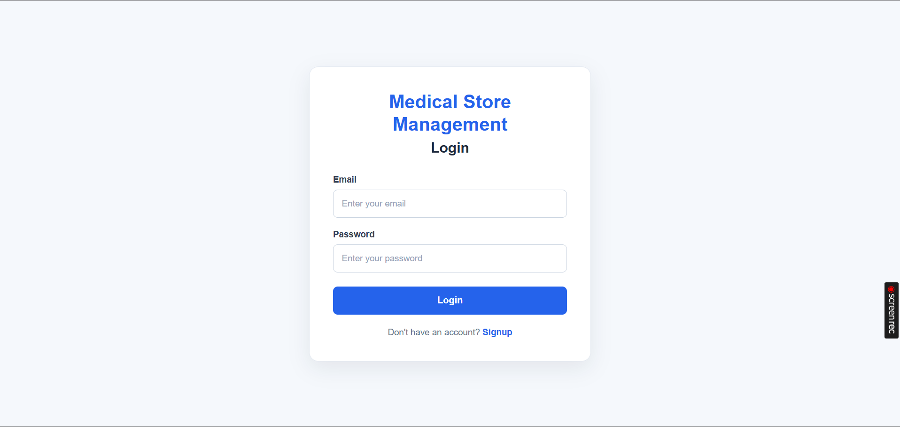
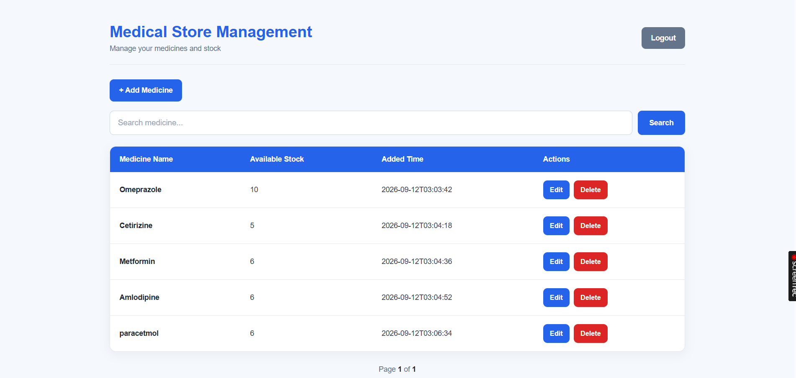

# Medical Store Management System

A web-based Medical Store Management System built using Spring Boot, Thymeleaf, Spring Data JPA, MySQL, and Spring Security.

The application allows users to securely manage their medicines and maintain available stock through a simple and user-friendly interface.

## Features

- User Signup and Login
- Session-based user authentication
- Add medicines with available stock
- Maximum of 5 medicines per user
- View medicines added by the logged-in user
- Search medicines by name
- Pagination for medicine listings
- Edit medicine details
- Delete medicines
- Automatic recording of medicine added time
- User-specific medicine management
- Responsive and clean UI

## Screenshots

### Login



### Medicine List



## Technology Stack

- **Backend:** Java, Spring Boot
- **Frontend:** HTML, CSS, Thymeleaf
- **Database:** MySQL
- **ORM:** Spring Data JPA / Hibernate
- **Security:** Spring Security
- **Build Tool:** Maven
- **Java Version:** 21

## Project Structure

```text
medicalstore
├── src
│   ├── main
│   │   ├── java
│   │   │   └── com.example.medicalstore
│   │   │       ├── config
│   │   │       ├── controller
│   │   │       ├── entity
│   │   │       ├── repository
│   │   │       └── service
│   │   │
│   │   └── resources
│   │       ├── static
│   │       │   └── css
│   │       ├── templates
│   │       └── application.properties
│   │
│   └── test
│
├── pom.xml
└── README.md
